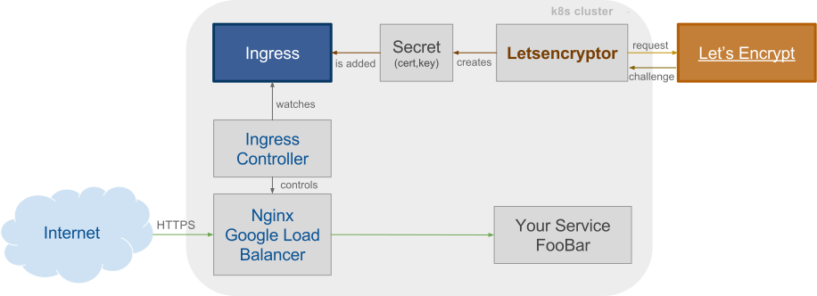

# kubernetes-letsencrypt
Let'sEncrypt meets Kubernetes. Use Let'sEncrypt together with the Ingress API

## Ingress meets Let's Encrypt
TODO: Update and clean up.

See: http://kubernetes.io/docs/user-guide/ingress/

We are using GCEs with internal load balancer, follow the instruction in this tutorial:
https://cloud.google.com/container-engine/docs/tutorials/http-balancer

Alternatively the nginx ingress controller proposed in: https://github.com/kubernetes/contrib/tree/master/ingress/controllers/nginx can be used.

- Create a host/domain, add it to the ingress yaml and create the ingress:
    `kubectl create -f k8s/letsencryptor.ingress.yaml --namespace=minefield`
    
- Create a tls secret:
    `kubectl create -f k8s/letsencryptor.secret.yaml --namespace=minefield`

- Create persistent disks for letsencrpyt:
    `gcloud compute disks create --size 100GB server-letsencryptor-workdir --project=<YOUR_PROJECT> --zone=<ZONE>`

- Create the replication controller for the letsencryptor:
    `kubectl create -f k8s/letsencryptor.rc.yaml --namespace=minefield`
